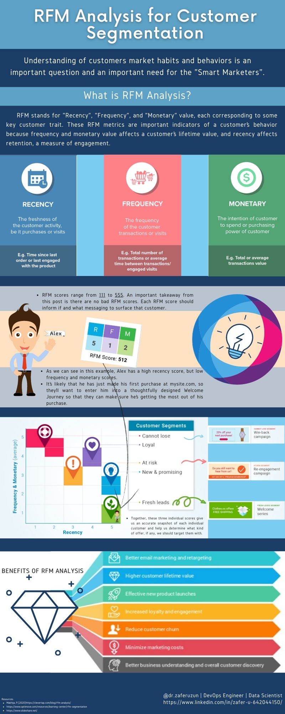

# __RFM Analysis for Customer Segmentation__

- __Understanding of customers market habits and behaviors is an important question and an important need for the "Smart Marketers".__

## __What is RFM Analysis?__

-  RFM stands for "Recency", "Frequency", and "Monetary" value, each corresponding to some key customer trait. These RFM metrics are important indicators of a customer’s behavior because frequency and monetary value affects a customer’s lifetime value, and recency affects retention, a measure of engagement.

- Let's look at this infographic below.

 

- And it is the time for hands on: 

                        Good luck.

 